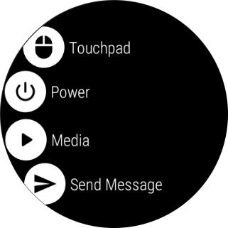

# Wear Remote - Wear OS application

Wear OS Android application
for [Remote Control Server](https://github.com/vinsce/RemoteControlServer).

 

### Features

- Remote touchpad
- Remote power actions (shutdown, reboot, sleep)
- Remote media control (volume, playback)

  

### Usage

1. Download and run the [Remote Control Server](https://github.com/vinsce/RemoteControlServer)
2. Install the WearRemote application on your Wear OS device and configure the IP address of the
   server

> Note: the project is work in progress and as of today it is intended for experimenting with gRPC and Android Wear OS.
> Contributions are accepted, as always :)